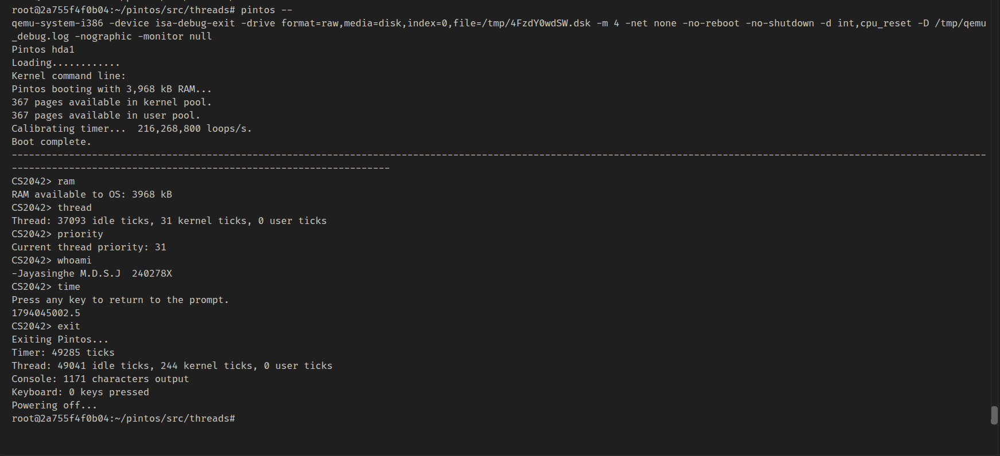

# Project 0: Getting Real

## Preliminaries

>Fill in your name and email address.

Chamath Jayasinghe chamath.24@cse.mrt.ac.lk

>If you have any preliminary comments on your submission, notes for the TAs, please give them here.

>Please cite any offline or online sources you consulted while preparing your submission, other than the Pintos documentation, course text, lecture notes, and course staff.

[1] P. D. J. B. Karunarathne and D. E. W. V. Nanayakkara, "OS Prerequisite - Installing Pintos OS," [Course Code: Course Name], University of Moratuwa, 2026. [Online]. Available: https://online.uom.lk/pluginfile.php/1059836/mod_resource/content/2/OS%20Prerequisite%20-%20Installing%20Pintos%20OS.pdf

[2] PKU-OS, "pintos," GitHub repository. [Online]. Available: https://github.com/PKU-OS/pintos

[3] jhu-cs318, "pintos," GitHub repository. [Online]. Available: https://github.com/jhu-cs318/pintos

## Booting Pintos

>A1: Put the screenshot of Pintos running example here.

## Debugging

#### QUESTIONS: BIOS 

>B1: What is the first instruction that gets executed?

The first Pintos instruction executed after the BIOS transfers control to the boot sector is `sub %ax, %ax` in `loader.S`. This clears `AX` before the loader initializes the data and stack segments.

>B2: At which physical address is this instruction located?

The BIOS loads the boot sector at physical address `0x7c00` and jumps to that address. Therefore, the instruction is located at physical address `0x7c00`.

#### QUESTIONS: BOOTLOADER

>B3: How does the bootloader read disk sectors? In particular, what BIOS interrupt is used?

The bootloader uses the BIOS extended disk-read service. `read_sector` builds a disk-address packet, sets `AH` to `0x42`, and invokes BIOS interrupt `0x13` (`int $0x13`). The carry flag indicates whether the read failed.

>B4: How does the bootloader decides whether it successfully finds the Pintos kernel?

It reads sector 0 and checks for the MBR signature `0xaa55` at offset 510. It then scans the four partition entries. A partition is selected only when it is in use, has Pintos partition type `0x20`, and has the bootable flag `0x80`.

>B5: What happens when the bootloader could not find the Pintos kernel?

The loader prints `Not found` and invokes BIOS interrupt `0x18`, which hands control back to the BIOS boot-failure handler. If a sector read fails while loading, it prints `Bad read` and also invokes `int $0x18`.

>B6: At what point and how exactly does the bootloader transfer control to the Pintos kernel?

After selecting a bootable Pintos partition, the loader reads the kernel into physical memory starting at `0x20000`. It reads the ELF entry address from offset `0x18`, stores it as a real-mode segment:offset pointer using segment `0x2000`, and executes `ljmp *start`. This transfers control to `start` in `start.S`, which switches to protected mode and calls `pintos_init()`.

#### QUESTIONS: KERNEL

>B7: At the entry of pintos_init(), what is the value of expression `init_page_dir[pd_no(ptov(0))]` in hexadecimal format?

At the entry of `pintos_init()`, `bss_init()` has set the global pointer `init_page_dir` to `0x00000000`; `paging_init()` has not run yet. Also, `pd_no(ptov(0))` is `0x300` (768). Therefore, the expression attempts to read `((uint32_t *)0x0)[0x300]` and has no valid hexadecimal value. In GDB, record `init_page_dir = 0x00000000` and `pd_no(ptov(0)) = 0x00000300`; dereferencing the expression at this point is invalid.

>B8: When `palloc_get_page()` is called for the first time,

>> B8.1 what does the call stack look like?
>>
>> `palloc_get_page()` -> `palloc_get_multiple()` -> `paging_init()` -> `pintos_init()`

>> B8.2 what is the return value in hexadecimal format?
>>
>> With Pintos's default `-m 4` setting, the return value is `0xc0101000`. The kernel pool begins at `0xc0100000`, and its bitmap occupies the first page.

>> B8.3 what is the value of expression `init_page_dir[pd_no(ptov(0))]` in hexadecimal format?
>>
>> After the first allocation and before the page-table loop installs the entry, the value is `0x00000000`. The page directory was allocated with `PAL_ZERO`, so entry `0x300` is initially zero.

>B9: When palloc_get_page() is called for the third time,

>> B9.1 what does the call stack look like?
>>
>> `palloc_get_page()` -> `palloc_get_multiple()` -> `thread_create()` -> `thread_start()` -> `pintos_init()`

>> B9.2 what is the return value in hexadecimal format?
>>
>> With the default 4 MB configuration, the return value is `0xc0103000`. The first allocation is the page directory, the second is the page table for the kernel mapping, and the third is the page for the initial idle thread.

>> B9.3 what is the value of expression `init_page_dir[pd_no(ptov(0))]` in hexadecimal format?
>>
>> The value is `0x00102007`. Entry `0x300` points to the page table at physical address `0x00102000`; the low flags are `PTE_U | PTE_P | PTE_W`, which equal `0x007`.

## Kernel Monitor

>C1: Put the screenshot of your kernel monitor running example here. (It should show how your kernel shell respond to `whoami`, `exit`, and `other input`.)

#### 

Capture a screenshot showing the prompt, `whoami`, `exit`, and an unrecognized command. Replace the placeholder image above with that screenshot.

>C2: Explain how you read and write to the console for the kernel monitor.

The monitor reads input by calling `input_getc()`. Keyboard and serial interrupt handlers place received characters into the shared input queue with `input_putc()`. `input_getc()` disables interrupts, removes one character from the queue, notifies the serial driver, restores the previous interrupt level, and returns the character.

It writes output with `printf()`. The kernel console implementation formats the text with `vprintf()` and sends each character to both the VGA display and serial output. The console lock prevents concurrent kernel threads from mixing their output.

The source used for these answers is available in the [PKU-OS Pintos repository](https://github.com/PKU-OS/pintos), especially [`loader.S`](https://github.com/PKU-OS/pintos/blob/master/src/threads/loader.S), [`start.S`](https://github.com/PKU-OS/pintos/blob/master/src/threads/start.S), [`init.c`](https://github.com/PKU-OS/pintos/blob/master/src/threads/init.c), [`palloc.c`](https://github.com/PKU-OS/pintos/blob/master/src/threads/palloc.c), [`input.c`](https://github.com/PKU-OS/pintos/blob/master/src/devices/input.c), and [`console.c`](https://github.com/PKU-OS/pintos/blob/master/src/lib/kernel/console.c).
